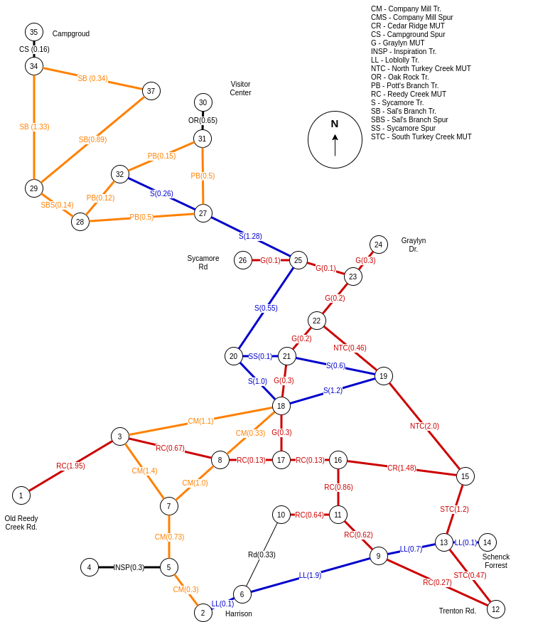

# umstead_thruhike

Figure out the best way to hike all trails in the [Umstead NC State Park](https://www.ncparks.gov/william-b-umstead-state-park/home).


The goal is to start at a car-accessible location, hike every official trail in the park and end up at the starting location. This known as [the Chinese postman or the route inspection problem](http://en.wikipedia.org/wiki/Route_inspection_problem) in graph theory.

Back in 2015 I figured out one optimal path for starting at the Reedy Creek entrance off of Harrison Ave.:

```text
1, 6, 9, 13, 15, 13, 14, 13, 12, 9, 11, 10, 11, 16, 15, 19,
22, 21, 20, 21, 22, 23, 24, 23, 25, 27, 31, 30, 31, 32, 28,
29, 37, 34, 35, 34, 29, 28, 27, 32, 27, 25, 26, 25, 20, 18,
21, 19, 18, 8, 3, 7, 3, 2, 3, 18, 17, 16, 17, 8, 7, 5, 4, 5, 1
```

This was according to the [networkx graph Python module](https://networkx.org/documentation/stable/reference/introduction.html).

The numbers are nodes on a graph representing trail junctions. Loops that start and end at the same junction like the Inspiration Trail and and a few others are not handled well. Edges represent trail segments between junctions. They are labeled with mnemonics of the trail name on which this trail segment lies and, in parentheses, distance in miles of the segment.

